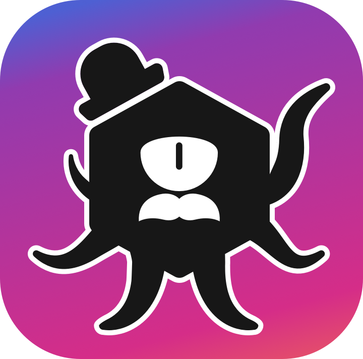

# Diceflayer - Unleash the Power of the Dice!

[Diceflayer](https://t.me/MrDiceflayerBot) is a Telegram Mini App designed to assist users in rolling dices for tabletop games like Dungeons & Dragons.

**This repository houses both the frontend and backend code for the Diceflayer Telegram mini-app.** You can access and interact with the bot by adding it to Telegram, just click [HERE](https://t.me/MrDiceflayerBot).

## Adventurer! Bring this with you 📜 
This project is an implementation of a Telegram Mini App and Telegram classic Bot. Before you begin, it is highly recommended to consult the official documentations:

- 📖 [Telegram Mini Apps Official Documentation](https://core.telegram.org/bots/webapps)
- 🤖 [Telegram Bot Official Documentation](https://core.telegram.org/bots)

Familiarizing yourself with these resources will ensure a seamless experience with Diceflayer.

## Table of Contents

- [Overview](#overview)
- [Technologies Used](#technologies-used)
- [Navigate the repo](#navigate-the-repo)
- [License](#license)
- [Thanks](#thanks)

## Overview
In the grand realm of online tabletop gaming, Diceflayer emerges as a hero, simplifying the dice-rolling process by offering an easy-to-use interface within the Telegram app. This project is forged with React and Reactstrap for the [Frontend](./frontend/README.md), and Python and Flask for the [Backend](./backend/README.md). Embark on a journey through our documentation to explore the project and learn the arcane arts of crafting your very own Telegram bot with a Mini Web App included!

## Technologies Used

- [Frontend](./frontend/README.md): The frontend uses React.js and Reactstrap UI library, along with telegram functionalities provided by an open source react framework.
- [Backend](./backend/README.md): The backend uses Python(v3.11.3) and Flask, along with telegram official api to manage bot services through https requests.

> Check their respective documentation to learn more about them

## Navigate the repo

This repository contains both the fronted and backend source code of the application. Each folder contains a `README.md` file with specific informations about the part of the project you are exploring. In each folder you will also find a `docs/` folder contaning specific guides to help you install the bot or start your own project using this one for reference. 

To simplify the navigation and the project set up you can use the link below:

- [Frontend documentation legend](./frontend/docs/README.md)
    - [Main](./frontend/README.md): Here you will find the overview set up for the frontend project.
    - [Bot setup guide](./frontend/docs/bot-setup-guide.md): Follow the steps inside this guide to create a Telegram Bot.
    - **Hosting**: In order to visualize the mini app on your bot you will need to host the project somewhere.
        - [Hosting on Github Pages](./frontend/docs/gh-pages-setup-guide.md): Here you can check the guide on how host the project on Github pages and make the mini app available on your telegram bot.
        - [Hosting through Ngrok](./frontend/docs/ngrok-setup-guide.md): Here you can check how to set up ngrok to host the project and develop without the need of deploying a new build each time you update the source code.
    - [Want to start from scratch?](./frontend/docs/develop-from-zero.md): Check this guide to setup a new react app and link it to your telegram bot.
- [Backend documentation legend](./backend/docs/README.md)
     - [Main](./backend/README.md): Here you will find the overview set up for the backend project.
     - [Bot setup guide](./backend/docs/bot-setup-guide.md): Follow the steps inside this guide to create a Telegram Bot and configure it to work with the backend project.
    - **Hosting**: In order to let your bot use this backend you will need to host the project somewhere.
        - [Hosting on Heroku](./backend/docs/heroku-setup-guide.md): Here you can check the guide on how host the project on Heroku platform.
        - [Hosting through Ngrok](./backend/docs/ngrok-setup-guide.md): As per fronted, you can use ngrok to host the backend and develop without the need of deploying a new build each time you update the source code.

## License
This project is dual-licensed under the **BSD License** and the **MIT License**. You are free to use, modify, and distribute the code. If you fork this project or use it as a base, please remember to cite the original author, [@Tratt0re](https://github.com/Tratt0re), in your documentation.

- [MIT licence](./MIT_LICENSE)
- [BSD licence](./BSD3_LICENSE)

## Thanks

- Special thanks to my friend Piero, to have given me the idea of a dice rolling telegram mini app, and supported me with suggestions during the development. Keep your AC solid ✌🏻🛡️
- Also a huge thanks to my friend Edo, to have found a tricky bug i didn't notice! May your save rolls never get a 1 💪🏻🪄
