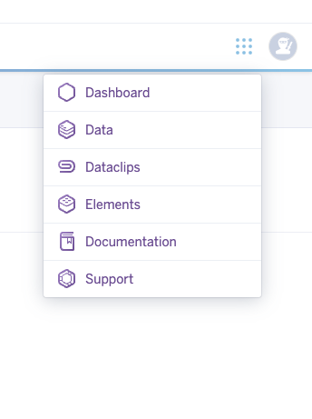
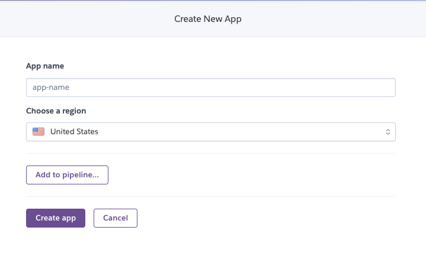
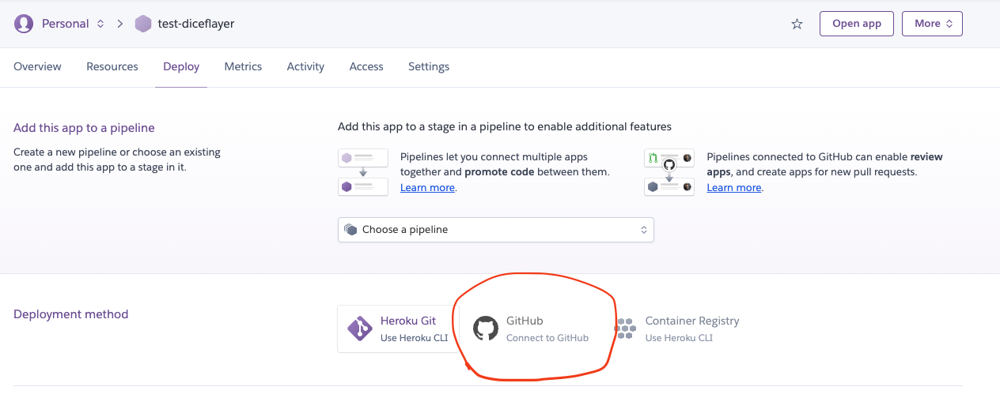
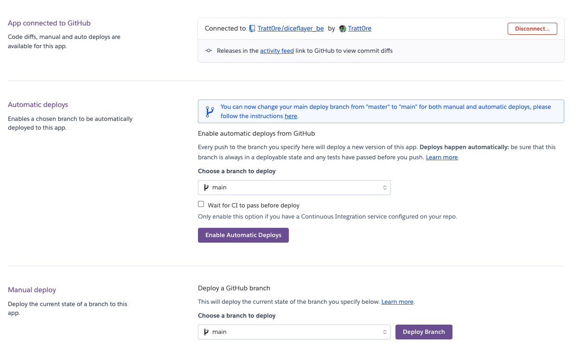
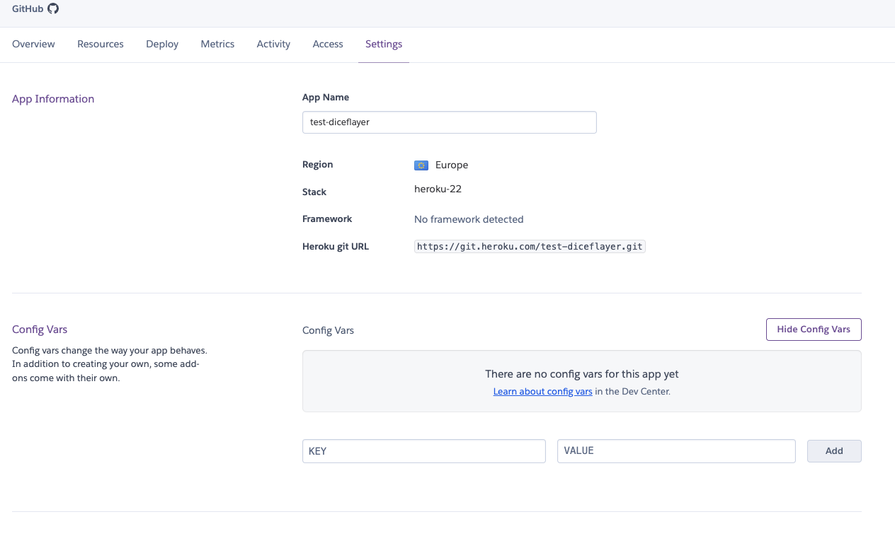

# Heroku Setup Guide

This guide will walk you through the process of deploying your Flask app on Heroku. Heroku is a cloud platform that allows you to host and manage your web applications. nfortunately they didn't offer any free plan, but their default paln is affordable and their service make really fast and easy to continuous deploy your app by pushing on github and develop at speed.

To simplify the setup we will link heroku to a github account all by the GUI provided by the heroku website.

## Prerequisites

Before you begin, make sure you have the following:

- A Heroku account. If you don't have one, sign up for free at [Heroku](https://www.heroku.com/).
- A working Flask app, such as the Diceflayer backend.
- A github account and a repo to which push your project.

>If for any reason you shoud encounter problem in deploying the Flask app on Heroku following this giude, you can relay on the official Documentation at https://devcenter.heroku.com/categories/python-support

To automate and simplify the pocesses you will need to deploy your project to github. You can use this project if you want, in this case i suggest you to copy the backend folder in a new project and start from there. 

## Heroku Setup

- **Create a Proc file**: this project start already with a Proc file, if you are using it just as a reference you will need to create your own. Proc files are configuration files used by Heroku to start your application. Create a new Procfile without any extension and copy this command in it: 
```bash
web: gunicorn app:app --workers 1
```
This is a gunicorn command that will run your app on heroku. I've set the workers to 1 because heroku set them to 2 by default, you can freely edit this string according to your project needs.

- **Login to Heroku**: go to the [Heroku](https://www.heroku.com/) homepage and log into their website. 

- **Go to the Dashboard**: using the menu navigate to the dashboard


- **Create new project**: Press on the "New" button and then on "Create new app"

- **Add name and server location**: 

At this point you will need to link your Heroku app with Github in order to implment automatic deployment

- **Link Github**: On the App "Deploy" page tap on "Connect to Github" 

- **Choose your repository and deply the app**:  choose freely if you want to run automatic or manual deploys. For convenience i enabled automatic ones.

Now every time you push on the repository branch you selected you will be able to deploy the app.

- **set env variable**: Move on the "Settings" page and add the bot_token as an env variable 
set as Key `TELEGRAM_BOT_TOKEN` and as Value your bot token.


## What's next ?
Now that your bot backend is running on the web you can use the heroku app url to call your backend services. Check the [Frontend](../../frontend/README.md#installation) part to know how to set up the url in the project.

## Are you lost?
Click [HERE](../README.md) to reach the main documentation page.